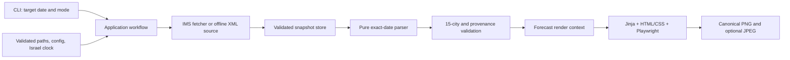

# July 2026 Refactor Audit

Status: implementation handoff for `2026-07-refactor`

Audit date: 2026-07-20

Audited base commit: `27ed1ee` (`chore: prepare repository for modern agents and Codex cloud`)

## Purpose

This document records what is actually in the repository before the planned
refactor. It is intentionally more critical and detailed than
`docs/PROJECT_STATUS.md`: the status page is the restart map, while this audit
is the working contract for the refactor branch and its eventual pull request.

The immediate product milestone remains:

> Generate one correct local 1080x1920 Instagram Story image from real IMS data,
> then inspect it at normal size.

Email delivery, scheduled production automation, multiple layouts, and a live
Figma dependency are not part of that milestone.

## Executive assessment

The refactor is justified, but a ground-up rewrite is not.

The repository has a useful foundation: readable data models, a functioning
happy-path IMS XML parser, retrying fetch helpers, archive and file-output
utilities, committed design assets, and 54 passing tests. The HTML/CSS +
Playwright architecture is also the right fit for this project and its
maintainer.

However, the repository is not yet a reliable data-to-image system. The main
workflow and renderer are placeholders, the most important fallback path has a
confirmed date-selection defect, parsing can silently succeed with fewer than
the required 15 cities, configuration errors fail open, and there is no
committed visual reference against which an offline/cloud agent can judge the
design.

The safest refactor strategy is therefore:

1. Add characterization and contract tests around the current useful behavior.
2. Repair data correctness and provenance before rendering it.
3. Build one thin offline vertical slice from XML fixture to saved image.
4. Replace that fixture with a real IMS fetch only after the same path works
   deterministically.
5. Defer email and scheduling until the image is visually accepted.

## Audit scope and evidence

Reviewed:

- All tracked source, tests, configuration, templates, setup files, and current
  documentation.
- Committed fonts, logos, map assets, weather icons, and Git LFS integrity.
- Relevant Git history and unmerged remote branches.
- Local ignored journal, legacy agent guidance, experiments, and IMS reference
  XML for context only. Private details are not reproduced here.
- Static relationships between city configuration, Figma positions, weather
  codes, icon mappings, fonts, and assets.

Not used:

- Live IMS network calls.
- Live Figma access.
- Email credentials or SMTP calls.
- A browser screenshot, because the renderer and template are still
  placeholders and no accepted reference image exists in the repository.

## Verified baseline

| Area | Verified result | Interpretation |
| --- | --- | --- |
| Automated tests | `54 passed in 0.85s` on Python 3.12.13 | The existing unit suite is green when dependencies and a writable pytest temp directory are supplied. |
| Coverage | 56% overall | Useful as a map, not a quality score. Main, renderer, design helpers, and email are at 0%; the parser fallback path is largely uncovered. |
| Compilation | `compileall` completed for `src/` and `tests/` | Tracked Python is syntactically valid. |
| Entry point | `python -m src.main` prints a placeholder and exits successfully | This is expected unfinished behavior, not an end-to-end pass. |
| Real-shaped local XML | Four forecast dates each parsed to 15 unique cities on the happy path | The parser understands the stored IMS shape when configuration is available and data is valid. |
| JSON | All three committed JSON configuration files parse as UTF-8 | File syntax and encoding are sound. |
| City alignment | 15 configured internal city keys exactly match 15 Figma position keys | This mapping is worth preserving. |
| Binary assets | Every committed PNG opens; all 16 weather icons are 160x160 RGBA | The present files are readable, although catalog coverage is incomplete. |
| Git LFS | `git lfs fsck` passed | Current LFS objects are available and internally consistent. |
| Secrets at `HEAD` | No tracked password/private-key pattern found | The real `.env` remains ignored. This is not a full history or security audit. |

The repository `.venv` remains unusable because it points to a removed
Microsoft Store Python. For this audit, dependencies were installed into an
ignored `_experiments/ims-audit-venv` environment. Pytest also needed
`--basetemp` under `_experiments/` because the Codex desktop sandbox could not
access the normal Windows temp directory.

Advisory static checks found 29 default Ruff findings and 9 Mypy findings. Most
are ordinary unused imports or missing type narrowing, but they confirm that no
lint/type contract is currently enforced. These tools were audit aids, not
configured project gates.

The Linux cloud setup script was read and its line endings were checked, but
`bash -n` could not run locally because this Windows machine has no installed
WSL distribution. That is an environment limitation rather than evidence that
the script is invalid.

## What should be preserved

- The high-level separation between data, design/rendering, delivery, and
  orchestration.
- The HTML/CSS + Jinja2 + Playwright rendering decision and browser-native RTL.
- Plain, readable dataclasses as the forecast vocabulary.
- The committed city configuration and its exact alignment with design
  positions.
- Mocked network behavior in the default automated tests.
- Explicit UTF-8 handling and the existing encoding-normalization knowledge.
- `pathlib` for filesystem work, once paths are anchored correctly.
- The current `AGENTS.md`, `README.md`, and `docs/PROJECT_STATUS.md` as the
  authoritative documentation core.
- Git LFS for genuinely binary/large visual assets.

The goal is to make these pieces trustworthy and connected, not to replace
them with a framework-heavy architecture.

## Priority findings

Priority meanings:

- **Blocker**: must be addressed to reach the first image milestone safely.
- **High**: can produce incorrect data or make refactoring unsafe.
- **Medium**: maintainability, reproducibility, or future-production debt.

### F-01 — Blocker: there is no runnable product path

`src/main.py:63-91` ignores its declared CLI options, prints a roadmap, and
returns success. `src/rendering/template_renderer.py:16-34` raises
`NotImplementedError`; `src/rendering/templates/forecast_story.html:20-23` is
placeholder content; and the token accessors in `src/design/tokens.py:32-102`
are all stubs.

The CLI therefore cannot fetch, archive, parse, render, save, or report a
meaningful failure. No production code calls the archive helpers. The manual
JSON exporter fetches and parses directly and also bypasses archive fallback
(`tests/manual/export_forecast_json.py:79-120`).

**Direction:** create one application-level function with an explicit result
and meaningful exit code. Keep email out of this path.

### F-02 — Blocker: per-city fallback selects and disguises the wrong date

`_parse_cities_to_dict()` accepts `target_date_str` but never uses it
(`src/data/parser.py:343-379`). It takes the first date in each archived city.
`_use_fallback_city()` then discards that source date and labels the values with
the requested date (`src/data/parser.py:525-527,562-577`).

This was reproduced with the local real-shaped, four-day IMS sample:

- Requested fallback date: 2025-12-18.
- Selected source date: 2025-12-17.
- Selected Eilat maximum: 16 degrees.
- Correct 2025-12-18 value present in the same fallback XML: 17 degrees.
- Returned model date: 2025-12-18.

That is silent data corruption, not merely stale data.

**Direction:** search prior snapshots for the requested forecast date, retain
the source snapshot and value dates as provenance, and never relabel a value
from a different forecast date.

### F-03 — Blocker: parsing can silently succeed with an incomplete city set

`parse_cities_forecast()` catches every per-city exception and continues
(`src/data/parser.py:324-337`). A failed fallback returns `None`
(`src/data/parser.py:518-523`). `DailyForecast` has no invariant for expected
IDs, uniqueness, or date alignment (`src/data/models.py:116-167`).

This was also reproduced: changing one optional humidity value to a non-number
logged an error, dropped Eilat, and returned 14 cities as a successful result.
Reversed temperatures and unusable fallback data can follow the same path.

The current parser tests normalize partial data by treating a handcrafted
two-city fixture as complete (`tests/test_parser.py:152-160,241-255`).

**Direction:** after allowed fallback, require exactly the configured set of 15
unique city IDs. Return a structured failure rather than a publishable partial
forecast.

### F-04 — Blocker: visual acceptance has no offline oracle

The repository contains design tokens and assets, but no approved full-layout
reference image or frozen forecast dataset that produces it. The only URL to
the complete design points to Figma. This conflicts with the requirement that
ordinary/cloud work not depend on live Figma.

The current tokens are also not a complete standalone specification: logo
dimensions and some component geometry are absent, and there is no implemented
font loading or rendered-state example.

**Direction:** before layout optimization, commit through Git LFS:

1. One owner-approved Figma export of the target 1080x1920 design.
2. The sanitized forecast fixture/data context used by that export.
3. A short note identifying the frame/version and what visual differences are
   acceptable.

A golden-image check may detect regressions, but normal-size human inspection
remains the final visual gate.

### F-05 — High: weather, token, font, and code contracts disagree

Static cross-checks found:

- `config/00_ims_weather_codes.json:7-145` defines 23 Israel forecast codes.
- `src/design/icon_mapper.py:24-59` maps 21 codes.
- Missing icon mappings for supported Israel codes: `1080`, `1160`, `1270`,
  `1570`, and `1590`.
- Extra mapper codes outside the Israel set: `1090`, `1200`, and `1240`.
- The weather file's notes claim 31 worldwide codes, while the JSON currently
  contains 34 (`config/00_ims_weather_codes.json:148-400`).
- `config/design_tokens.json:58-64` names
  `NotoSansHebrew-ExtraCondensed`, but that font is not committed.
- The `get_color("background")` example in `src/design/tokens.py:10-18` has no
  matching `colors.background` token.
- `get_city_position()` promises `label_anchor`
  (`src/design/tokens.py:80-91`), while the JSON provides `layout`.

Every currently mapped icon file exists, but not every supported IMS condition
has a deliberate display rule.

**Direction:** use one validated weather catalog containing descriptions and
icon choice, plus a startup/test-time design contract that validates every
city, token, font, and asset reference.

### F-06 — High: archive and fallback semantics are incomplete

The archive helpers exist, but no orchestration connects fetch failure to
archive retrieval. `parse_daily_forecast()` accepts only city fallback XML, not
country fallback XML (`src/data/parser.py:581-624`). Its top-level
`is_fallback` value is always `False`, even after it counts fallback cities.

Archive filenames represent fetch dates, while callers reason about forecast
dates. `get_fallback_for_date()` searches filenames rather than XML contents
(`src/data/archive.py:111-148`). Same-day saves overwrite directly without
first validating and atomically replacing the previous last-known-good file
(`src/data/archive.py:40-66`).

**Direction:** model a snapshot with fetched-at time, IMS issue time, contained
forecast dates, and source/feed type. Archive only validated snapshots and
select the newest snapshot that contains the requested date.

### F-07 — High: paths and configuration depend on the current directory

Config, archive, output, logs, icons, tokens, and templates all use relative
paths defined as module globals. Configuration loaders catch every exception,
cache `{}`, and continue (`src/data/parser.py:38-40,72-104`).

This was reproduced by invoking the parser from a directory other than the
repository root: city and weather configuration failed to load, every normal
weather code became unknown, and the parser returned zero cities instead of a
configuration error.

**Direction:** create one small `AppPaths`/settings object at the application
boundary, resolve it from the repository/package rather than the shell's
current directory, validate it once, and pass dependencies into pure code.

### F-08 — High: date, time, freshness, and fallback provenance are ambiguous

The code uses machine-local `date.today()` and naive `datetime.now()` throughout
parsing, archive cleanup, output cleanup, model creation, and future email
subject generation. A cloud runner may use UTC rather than Israel time. The IMS
issue timestamp is not retained.

A single `is_fallback` boolean cannot say whether the country feed, the city
feed, or an individual city is stale, nor what source date was used.

**Direction:** use an explicit `Asia/Jerusalem` clock at the boundary; pass the
target date explicitly; preserve fetch time, IMS issue time, snapshot identity,
and per-value source date.

### F-09 — High: visual truth is duplicated and the renderer contract is undefined

The gradient is already duplicated in `config/design_tokens.json:9-28` and
`forecast_story.css:7-28`. Implementing Python accessors that copy every token
into CSS would create a third layer of visual truth.

The renderer stub does not define whether it returns PNG bytes, a path, or a
Pillow image. The existing file saver expects a Pillow image. The HTML links a
relative stylesheet; a future `page.set_content()` implementation would not
automatically give that link a usable local base URL.

**Direction:** make HTML/CSS the primary design implementation. Keep structured
JSON only where it adds value, such as canvas metadata and city placements, or
generate CSS variables in exactly one documented step. Define PNG as the
canonical renderer output and derive JPEG only if Pillow remains useful.

The Playwright implementation should explicitly:

- use autoescaped Jinja templates;
- resolve Windows and cloud asset paths to valid URLs;
- load committed fonts with `@font-face`;
- wait for `document.fonts.ready` and image decoding;
- fail on browser console/page errors and missing assets;
- screenshot the 1080x1920 canvas element at device scale 1;
- disable animation and other nondeterminism.

Jinja should also use strict undefined-variable behavior so a misspelled or
missing render field cannot quietly become blank output. Mixed numeric strings
such as Hebrew temperature ranges should be isolated with `dir="ltr"` or
`unicode-bidi: isolate`, while the city/map coordinates remain physical
top-left canvas coordinates.

### F-10 — High: the passing suite does not protect the risky behavior

The only fallback-labelled test says that a real fallback setup is still
needed; it supplies no fallback XML and merely checks that fresh cities are not
marked fallback (`tests/test_parser.py:258-269`).

There are no tests for:

- multi-day fallback selection or provenance;
- whole-feed fallback and missing archives;
- the exact 15-city ID contract;
- malformed optional values or reversed temperatures;
- model aggregate invariants;
- country-description completeness;
- CWD independence and Israel-time boundaries;
- configuration/asset/font/icon consistency;
- renderer output, RTL, fonts, assets, or browser errors;
- an offline XML-to-image vertical slice.

The robust local XML references are ignored and unavailable to cloud sessions.

**Direction:** commit sanitized production-shaped fixtures under
`tests/fixtures/ims/`, then add characterization tests before reorganizing the
data code.

### F-11 — Medium: imports and helpers have hidden side effects or weak APIs

- Importing data/delivery modules configures file logging and can create/open a
  file (`src/utils/logger.py:39-85`). Logging belongs at the application edge.
- Importing the email module loads `.env` (`src/delivery/email_sender.py:27-39`).
- Fetch helpers return `Optional[str]`, losing the failure reason needed for
  fallback and operator reporting (`src/data/fetcher.py:71-137`).
- `fetch_xml()` duplicates fetch behavior with different encoding and exception
  rules (`src/data/fetcher.py:140-158`).
- Output format helpers silently treat invalid formats as PNG or "all"
  (`src/delivery/file_saver.py:157-192`).
- `get_latest_output()` can pair JPEG and PNG files from different dates.
- The Hebrew calendar function returns literal placeholder text
  (`src/utils/date_utils.py:81-97`).

These should be simplified after the critical data contracts are protected.

### F-12 — Medium: setup and quality gates are not deterministic

Runtime and development dependencies are mixed in `requirements.txt`, all are
minimum-only ranges, and cloud setup upgrades pip and installs the latest
matching packages. There is no package/project configuration, lock or
constraints strategy, pytest configuration, lint/type configuration, coverage
policy, or PR test workflow. `.github/workflows/` contains only `.gitkeep`.

**Direction:** add a small `pyproject.toml`, separate runtime/dev requirements
or extras, select a tested lock/constraint strategy, and add offline PR CI.
This CI is distinct from the deferred daily production scheduler. Prefer tests
of critical contracts over an arbitrary global coverage percentage.

### F-13 — Medium: historical documentation can still misdirect agents

The current documentation core is accurate, but older tracked documents are
not safely quarantined:

- `docs/00_initial_plan.md` still contains obsolete Pillow/BiDi architecture
  and stale Phase 2 checkboxes.
- `docs/01_phase2_data_pipeline_plan.md` is still marked pending and leaves its
  success criteria unchecked despite the implemented happy path.
- `docs/99_folder_structure.md` lists nonexistent renderer files, an incorrect
  weather-code filename, and a nonexistent production workflow.
- `src/rendering/__init__.py:1-16` also describes the removed Pillow modules.
- `tests/__init__.py:17-20` lists a nonexistent rendering test.
- The changelog's "complete" data-pipeline wording overstates fallback
  confidence.

Ignored legacy agent files also contain stale counts, obsolete requirements,
and private contact information. They should remain private and should not be
copied wholesale into cloud-visible documentation.

**Direction:** move superseded plans to `docs/history/` with prominent banners,
replace the hand-maintained folder tree with a concise
`docs/ARCHITECTURE.md`, and preserve only durable non-private guidance in
`AGENTS.md`.

### F-14 — Medium: repository ownership decisions remain open

- No software license has been selected.
- There is no committed provenance/license inventory for fonts, icons, logos,
  or map assets.
- `mcp_config.json` is a tracked provider-specific Figma configuration even
  though live Figma is optional.
- Several remote `claude/*` branches contain unmerged Pillow-era renderers and
  tests. They may hold historical ideas, but they target the superseded
  architecture and should not be merged wholesale.

**Direction:** do not solve these by assumption. Record the owner's decisions,
add asset provenance where appropriate, and handle remote-branch cleanup as a
separate repository-maintenance action after useful history is assessed.

Visual asset review also found issues worth checking at final display size:
representative weather PNGs contain horizontal edge streaking, and
`ims_logo.svg` embeds a large raster rather than behaving like a lightweight
vector. Neither is a code blocker before the 50px/actual-layout inspection, but
both should be deliberately accepted or replaced. Cloud setup should also
verify that LFS assets are hydrated rather than silently rendering pointer
files.

The old `origin/claude/city-forecast-renderer-ugBFl` branch records useful
behavioral archaeology, including RTL/LTR/TTB ordering, icon-centered x/y
anchors, and a max-temperature-only display. Those are product decisions to
confirm and translate into HTML/CSS tests; the old Pillow implementation itself
should not be revived.

## Proposed target flow

Keep the architecture visible and shallow:



This does not require a dependency-injection framework. A few explicit
dataclasses/protocols and ordinary function parameters are enough.

## Product decisions to confirm

The refactor can use these recommendations as defaults, but they are product
decisions rather than facts discovered in code.

| Decision | Recommended default | Why |
| --- | --- | --- |
| Fallback meaning | Use the newest earlier snapshot that contains the exact requested forecast date. Never relabel a different date. | IMS feeds are multi-day; this uses a stale source without falsifying the forecast day. |
| Incomplete city set | Fail the image run if any of the configured 15 cities remains unavailable after allowed fallback. | Publishing a plausible-looking partial map is riskier than an explicit failure. |
| Visual source of truth | HTML/CSS is primary; JSON holds only validated structured values that CSS cannot express more clearly. | This matches the maintainer's skills and avoids three copies of every visual value. |
| Reference artifacts | Commit one approved target export and its sanitized data fixture via LFS. | Cloud sessions need an offline design oracle. |
| Canonical image | Produce PNG first; derive JPEG only when needed. | Playwright screenshots naturally produce PNG and it avoids compounding loss. |
| Default date/time | "Today" means `Asia/Jerusalem`; retain aware fetch and issue timestamps. | Local and cloud runs must select the same day. |
| Email | Explicitly deferred and excluded from the first vertical slice. | It does not help validate the product's central visual result. |
| Live Figma | Optional design-refresh tool, never a normal runtime or test dependency. | Committed assets and references must make cloud work reproducible. |

## Ordered refactor plan

Each slice should be a reviewable commit or small commit group. Do not combine
the entire plan into one untestable rewrite.

### Slice 0 — Protect the baseline

- Add `pyproject.toml` with pytest and selected lint/type configuration.
- Add offline PR CI; do not add the daily scheduler yet.
- Commit sanitized, production-shaped multi-day IMS fixtures.
- Add configuration/asset contract tests.
- Add characterization tests that expose the confirmed fallback-date and
  incomplete-city defects before fixing them.

Exit gate: the original 54 tests plus new characterization tests run
reproducibly; known defects fail for the expected reason or are marked in a
short-lived, explicit manner.

### Slice 1 — Define contracts and remove hidden environment state

- Define `AppPaths`/settings and an injectable Israel-time clock.
- Define forecast snapshot and provenance fields.
- Validate configuration once and fail fast.
- Move logging and `.env` loading to the application boundary.

Exit gate: parsing/config tests pass when launched outside the repository root;
imports do not create files.

### Slice 2 — Repair fetch, archive, parse, and validation

- Choose a single fetch API with structured failure information.
- Validate and atomically store last-known-good snapshots.
- Select an exact target date from current or archived multi-day XML.
- Enforce required country text and the exact 15-city set.
- Preserve per-feed and per-city provenance.
- Remove broad exception paths that convert programmer/data errors into partial
  success.

Exit gate: all fallback, stale-source, invalid-value, and completeness tests
pass with no network.

### Slice 3 — Establish one visual data contract

- Resolve the missing product decisions and asset mappings.
- Add the approved reference export and frozen render fixture.
- Consolidate weather descriptions and icon selection.
- Decide which design values live in CSS and which remain structured tokens.
- Build a typed/plain render-context adapter so Jinja does not depend on parser
  internals.

Exit gate: one validated context contains exactly the 15 positioned cities,
deliberate icons, formatted Hebrew dates/text, and resolvable assets/fonts.

### Slice 4 — Implement deterministic HTML/CSS rendering

- Implement the real RTL template and committed font faces.
- Implement Playwright lifecycle, asset readiness, browser error capture, and
  element screenshot.
- Add renderer hard-gate tests and save a review artifact.

Exit gate: deterministic 1080x1920 PNG from the frozen fixture, with no missing
assets, browser errors, placeholder text, or unexpected font fallback.

### Slice 5 — Connect the local CLI vertical slice

- Implement `python -m src.main` as fetch/source -> snapshot -> parse -> validate
  -> render -> save.
- Support an offline input/fixture mode for reproducible debugging.
- Parse `--date` strictly and use meaningful nonzero exit codes.
- Keep email disabled/out of the path.

Exit gate: one command produces PNG and, if retained, JPEG from fixture data;
one separately authorized/manual run produces the same layout from real IMS
data.

### Slice 6 — Visual acceptance and documentation reconciliation

- Inspect the real 1080x1920 output at normal size against the approved export.
- Update `README.md`, `docs/PROJECT_STATUS.md`, `CHANGELOG.md`, and a concise
  `docs/ARCHITECTURE.md` to match the implementation.
- Move superseded plans/audit material to history after their decisions have
  been distilled.
- Record skipped checks and remaining risks in the PR.

Exit gate: owner accepts the image, tests are green, and the current docs make
no end-to-end claims beyond demonstrated behavior.

### Later work — separate milestones

- Email message construction, SMTP delivery, and credential validation.
- Production GitHub Actions schedule and failure notification.
- Additional social layouts.
- Retention/operational monitoring policies.
- Remote-branch and history/privacy cleanup.

## Recommended test shape

```text
tests/
  conftest.py
  fixtures/
    ims/
  test_models.py
  test_fetcher.py
  test_parser.py
  test_archive.py
  test_file_saver.py
  test_config_contracts.py
  test_template_renderer.py
  test_pipeline.py
  manual/
```

The default suite must remain offline. Live IMS checks should be explicitly
marked/manual. Rendering tests should enforce structural gates, while visual
approval remains a separately reviewed artifact.

## Refactor PR completion standard

The refactor PR is ready only when all of the following are true:

- The default test suite runs from a documented fresh environment and is green.
- A current-like multi-day fixture proves exact-date parsing and fallback.
- A successful forecast contains exactly 15 unique configured cities.
- Every rendered value has truthful target/source provenance.
- Every supported Israel weather code has a deliberate icon/display policy.
- Fonts and assets load from committed files without live Figma or network
  access.
- `python -m src.main` produces a real local image or exits nonzero with an
  actionable error.
- The actual output is exactly 1080x1920 and has been inspected at normal size.
- No placeholder text or `NotImplementedError` remains on the first-milestone
  path.
- Email and scheduling remain clearly deferred unless a later approved slice
  implements them.
- `README.md`, `docs/PROJECT_STATUS.md`, `CHANGELOG.md`, and architecture docs
  match the source.
- `git status` contains only intentional files and no credentials, generated
  forecasts, fetched XML, caches, logs, or private notes.

## Handoff note for refactor sessions

Begin with Slice 0 and keep this file as the branch contract. When evidence
contradicts this audit, update the audit or record the decision in the PR rather
than silently diverging. Source and tests remain authoritative.

After the refactor merges, move this document to
`docs/history/2026-07-refactor-audit.md` or replace it with a short completion
record after its durable decisions have been absorbed into the current docs.
