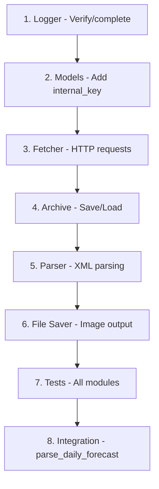

# Phase 2: Data Pipeline — Implementation Plan

**Created:** 2025-12-22  
**Author:** Noam Weiss + AI Planning Assistant  
**Status:** Pending Approval  
**Branch:** `feature/phase2-data-pipeline`

---

## Overview

This plan covers the complete implementation of **Phase 2: Data Pipeline** from the initial project plan. It consolidates data fetching, parsing, archiving, file saving, logging, and testing into a single coherent implementation phase.

### What's Included

| Module | Description | File |
|--------|-------------|------|
| **Data Fetcher** | HTTP requests with UTF-8 encoding and retry logic | `src/data/fetcher.py` |
| **Data Parser** | XML → Python dataclasses with weather code mapping | `src/data/parser.py` |
| **Data Models** | Add `internal_key` field and validation | `src/data/models.py` |
| **Archive System** | 7-day rolling backup with fallback logic | `src/data/archive.py` |
| **File Saver** | Dual-format image output (JPEG + PNG) | `src/delivery/file_saver.py` |
| **Logger** | Verify/complete logging infrastructure | `src/utils/logger.py` |
| **Test Suite** | Comprehensive tests for all modules | `tests/test_*.py` |

### What's NOT Included (Later Phases)

- Rendering/image generation → Phase 4
- Email delivery → Phase 5  
- GitHub Actions automation → Phase 6

---

## Goals

| Goal | Description |
|------|-------------|
| **Reliable fetching** | Download XML with UTF-8 encoding, retry on failure |
| **Clean parsing** | Convert XML structure to typed Python objects |
| **Fallback safety** | If fetch fails, use archived data from past 7 days |
| **Dual output** | Save images as both JPEG and PNG |
| **Consistent logging** | Clear, formatted logs for debugging |
| **Testability** | Each function independently testable with >80% coverage |

---

## XML Structure Analysis

Based on the sample XML files in `docs/internal/reference/`:

### Country Forecast (`isr_country.xml`)

```text
IsraelWeatherForecastMorning
└── Location
    └── LocationMetaData (LocationId=230, LocationNameHeb="ישראל")
    └── LocationData
        └── TimeUnitData (for each day)
            ├── Date (e.g., "2025-12-17")
            └── Element[] containing:
                ├── "Warning in English" / "Warning in Hebrew"
                └── "Weather in English" / "Weather in Hebrew"
```

### Cities Forecast (`isr_cities.xml`)

```text
IsraelCitiesWeatherForecastMorning
└── Location[] (15 cities)
    ├── LocationMetaData
    │   ├── LocationId (e.g., "520" for Eilat)
    │   ├── LocationNameEng / LocationNameHeb
    │   └── DisplayLat / DisplayLon
    └── LocationData
        └── TimeUnitData[] (4 days of forecast)
            ├── Date
            └── Element[] containing:
                ├── "Maximum temperature" / "Minimum temperature"
                ├── "Maximum relative humidity" / "Minimum relative humidity"
                ├── "Weather code" (e.g., "1250" for Clear)
                └── "Wind direction and speed" (e.g., "315-45/10-30")
```

---

## Proposed Changes

### 1. Data Fetcher

#### [MODIFY] [fetcher.py](file:///c:/Users/noamw/Desktop/ims/Auto_Forecast_Design/src/data/fetcher.py)

Replace placeholder implementations with working code:

**Functions to implement:**

| Function | Description |
|----------|-------------|
| `fetch_country_forecast()` | GET request to country XML, return string or None |
| `fetch_cities_forecast()` | GET request to cities XML, return string or None |
| `fetch_with_retry(url, retries=3)` | Retry logic with 30s wait between attempts |

**Key implementation details:**

- Use `response.content.decode('utf-8')` for proper Hebrew encoding
- Set `timeout=30` for requests
- Log all fetch attempts using the project's logger

---

### 2. Data Parser

#### [MODIFY] [parser.py](file:///c:/Users/noamw/Desktop/ims/Auto_Forecast_Design/src/data/parser.py)

**Functions to implement:**

| Function | Description |
|----------|-------------|
| `parse_country_forecast(xml)` | Parse XML → `CountryForecast` dataclass |
| `parse_cities_forecast(xml)` | Parse XML → `List[CityForecast]` |
| `parse_daily_forecast(country, cities)` | Combine into `DailyForecast` |

**Helper functions to add:**

| Function | Description |
|----------|-------------|
| `_extract_element_value(elements, name)` | Find element by name, return value |
| `_parse_wind_data(wind_str)` | Parse "315-45/10-30" → (direction, speed) |
| `_get_weather_description(code)` | Look up code in `00_ims_weather_codes.json` |

---

### 3. Data Models

#### [MODIFY] [models.py](file:///c:/Users/noamw/Desktop/ims/Auto_Forecast_Design/src/data/models.py)

Minor additions to existing dataclasses:

1. Add `internal_key: Optional[str]` to `CityForecast` for mapping to design tokens
2. Add `__post_init__` validation to ensure required fields are not empty

---

### 4. Archive System

#### [MODIFY] [archive.py](file:///c:/Users/noamw/Desktop/ims/Auto_Forecast_Design/src/data/archive.py)

**Functions to implement:**

| Function | Description |
|----------|-------------|
| `save_to_archive(xml, type, date)` | Save XML with UTF-8 encoding to `archive/YYYY-MM-DD_{type}.xml` |
| `get_fallback_xml(type)` | Find most recent archive (yesterday → 7 days back) |
| `cleanup_old_archives()` | Delete files older than `MAX_ARCHIVE_DAYS` |

> **Note:** `get_archive_path()` is already implemented.

---

### 5. File Saver

#### [MODIFY] [file_saver.py](file:///c:/Users/noamw/Desktop/ims/Auto_Forecast_Design/src/delivery/file_saver.py)

**Functions to implement:**

| Function | Description |
|----------|-------------|
| `save_forecast_image(image, date_str)` | Save as JPEG (quality 90) + PNG, return dict of paths |
| `cleanup_old_outputs(max_age_days=30)` | Delete old image files |

---

### 6. Logger

#### [MODIFY] [logger.py](file:///c:/Users/noamw/Desktop/ims/Auto_Forecast_Design/src/utils/logger.py)

**Verify/implement:**

| Function | Description |
|----------|-------------|
| `setup_logger(name, level="INFO")` | Create logger with console + file handlers |
| `get_logger(name)` | Return existing or create new logger |

**Expected format:** `timestamp | level | module | message`

---

### 7. Test Suite

#### [NEW] [test_fetcher.py](file:///c:/Users/noamw/Desktop/ims/Auto_Forecast_Design/tests/test_fetcher.py)

```python
# Tests to implement:
- test_fetch_country_forecast_success()
- test_fetch_cities_forecast_success()
- test_fetch_with_retry_eventual_success()
- test_fetch_with_retry_all_fail()
- test_encoding_preserves_hebrew()
```

#### [MODIFY] [test_parser.py](file:///c:/Users/noamw/Desktop/ims/Auto_Forecast_Design/tests/test_parser.py)

```python
# Replace placeholder 'pass' with real tests:
- test_parse_country_forecast_extracts_hebrew_description()
- test_parse_country_forecast_extracts_date()
- test_parse_cities_returns_15_cities()
- test_parse_city_temperature_values()
- test_parse_city_weather_code()
- test_weather_code_mapping()
- test_wind_data_parsing()
- test_hebrew_text_preserved()
```

#### [NEW] [test_archive.py](file:///c:/Users/noamw/Desktop/ims/Auto_Forecast_Design/tests/test_archive.py)

```python
# Tests to implement:
class TestSaveToArchive:
    - test_creates_archive_directory_if_missing()
    - test_saves_file_with_correct_name()
    - test_preserves_utf8_encoding()
    - test_returns_correct_path()

class TestGetFallbackXml:
    - test_returns_none_when_no_archive_exists()
    - test_returns_yesterday_if_available()
    - test_skips_to_older_archive_if_yesterday_missing()
    - test_returns_none_after_max_days()

class TestCleanupOldArchives:
    - test_deletes_old_files()
    - test_preserves_recent_files()
    - test_returns_correct_delete_count()
```

#### [NEW] [test_file_saver.py](file:///c:/Users/noamw/Desktop/ims/Auto_Forecast_Design/tests/test_file_saver.py)

```python
# Tests to implement:
- test_creates_output_directory_if_missing()
- test_saves_jpeg_with_correct_quality()
- test_saves_png_with_transparency()
- test_returns_both_paths()
- test_filename_includes_date()
```

---

## Error Handling Strategy

```text
┌──────────────────────────────────────────────────────────────┐
│                      FETCH WORKFLOW                          │
└──────────────────────────────────────────────────────────────┘

    ┌─────────────┐
    │ Attempt 1   │ ──fail──┐
    │ Fetch XML   │         │
    └──────┬──────┘         │
           │success         │
           ▼                ▼
    ┌─────────────┐   ┌─────────────┐
    │ Archive     │   │ Wait 30s    │
    │ Save copy   │   └──────┬──────┘
    └──────┬──────┘          │
           │                 ▼
           │          ┌─────────────┐
           │          │ Attempt 2   │ ──fail──┐
           │          └──────┬──────┘         │
           │                 │success         │
           │                 ▼                ▼
           │          ┌─────────────┐   ┌─────────────┐
           │          │ Archive     │   │ Wait 60s    │
           │          └──────┬──────┘   └──────┬──────┘
           │                 │                 │
           │                 │                 ▼
           │                 │          ┌─────────────┐
           │                 │          │ Attempt 3   │ ──fail──┐
           │                 │          └──────┬──────┘         │
           │                 │                 │success         │
           ▼                 ▼                 ▼                ▼
    ┌────────────────────────────────┐   ┌─────────────────────┐
    │          PARSE XML             │   │   USE FALLBACK      │
    │   Return DailyForecast         │   │   get_fallback_xml  │
    │   is_fallback = False          │   │   is_fallback = True│
    └────────────────────────────────┘   └─────────────────────┘
```

---

## Implementation Order



| Step | Task | File(s) | Time Est. |
|------|------|---------|-----------|
| 1 | Review/complete logger | `src/utils/logger.py` | 15 min |
| 2 | Add internal_key to models | `src/data/models.py` | 15 min |
| 3 | Implement fetcher | `src/data/fetcher.py` | 30 min |
| 4 | Implement archive | `src/data/archive.py` | 45 min |
| 5 | Implement parser | `src/data/parser.py` | 1 hour |
| 6 | Implement file saver | `src/delivery/file_saver.py` | 30 min |
| 7 | Create all tests | `tests/test_*.py` | 2 hours |
| 8 | Integration testing | End-to-end verification | 30 min |

**Total estimated time: ~6 hours**

---

## Verification Plan

### Automated Tests

```bash
# Run all tests
python -m pytest tests/ -v

# Run with coverage
python -m pytest tests/ --cov=src --cov-report=html

# Run specific module tests
python -m pytest tests/test_parser.py -v
```

### Manual Verification

```python
# Quick smoke test in Python REPL:
from src.data.fetcher import fetch_cities_forecast
from src.data.parser import parse_cities_forecast

xml = fetch_cities_forecast()
cities = parse_cities_forecast(xml)
print(f"Parsed {len(cities)} cities")
print(cities[0])  # Should show first city with Hebrew text
```

---

## Files Summary

| Action | File | Description |
|--------|------|-------------|
| MODIFY | `src/utils/logger.py` | Verify/complete logging setup |
| MODIFY | `src/data/models.py` | Add `internal_key`, validation |
| MODIFY | `src/data/fetcher.py` | Implement fetch functions |
| MODIFY | `src/data/archive.py` | Implement archive functions |
| MODIFY | `src/data/parser.py` | Implement parse functions |
| MODIFY | `src/delivery/file_saver.py` | Implement save functions |
| NEW | `tests/test_fetcher.py` | Fetcher unit tests |
| NEW | `tests/test_archive.py` | Archive unit tests |
| NEW | `tests/test_file_saver.py` | File saver unit tests |
| MODIFY | `tests/test_parser.py` | Replace placeholders with real tests |

---

## Design Decisions (Approved)

> [!NOTE]
> These decisions were confirmed by the project owner on 2025-12-22.

### 1. Date Selection

**Decision:** Optional date parameter, defaults to today.

```python
# Usage examples:
python -m src.main                    # Uses today's date
python -m src.main --date 2025-12-23  # Uses specific date
```

The parser should accept a `target_date` parameter. If not specified, use today's date.

---

### 2. Unknown Weather Codes

**Decision:** Fall back to yesterday's data for that city + notify user.

When a weather code is not found in `00_ims_weather_codes.json`:

1. Log a WARNING with the unknown code and city name
2. Use that city's data from the previous day's archive
3. Mark the city's data with `is_fallback = True`
4. **Immediately notify** the user (console + log)

```python
# Example notification:
WARNING: Unknown weather code '9999' for Jerusalem. Using yesterday's data.
```

---

### 3. Required Fields (No Optional Fields)

**Decision:** Temperature range and weather code are REQUIRED. Missing = fallback + notify.

All fields are mandatory for each city:

- `min_temp` (required)
- `max_temp` (required)  
- `weather_code` (required)

If ANY required field is missing:

1. Log an ERROR with city name and missing field
2. Fall back to last available data for that city
3. Mark the city's data with `is_fallback = True`
4. **Immediately notify** the user

```python
# Example notification:
ERROR: Missing 'max_temp' for Haifa. Using last available data from 2025-12-21.
```

> [!CAUTION]
> Humidity and wind data remain truly optional (can be `None`), but temperature and weather code must always be present.

---

## Fallback and Notification Logic

```text
┌─────────────────────────────────────────────────────────────────┐
│                   PER-CITY DATA VALIDATION                       │
└─────────────────────────────────────────────────────────────────┘

    For each city in XML:
    
    ┌─────────────────┐
    │ Check required  │
    │ fields exist    │
    └────────┬────────┘
             │
     ┌───────┴───────┐
     │               │
   Present        Missing
     │               │
     ▼               ▼
┌─────────────┐  ┌─────────────────────┐
│ Check       │  │ LOG ERROR           │
│ weather     │  │ Use yesterday's     │
│ code valid  │  │ data for this city  │
└──────┬──────┘  │ NOTIFY USER         │
       │         └─────────────────────┘
   ┌───┴───┐
   │       │
 Valid   Unknown
   │       │
   ▼       ▼
┌─────┐  ┌─────────────────────┐
│ Use │  │ LOG WARNING         │
│ as  │  │ Use yesterday's     │
│ is  │  │ data for this city  │
└─────┘  │ NOTIFY USER         │
         └─────────────────────┘
```

### Notification Methods

| Severity | Console | Log File | Email (future) |
|----------|---------|----------|----------------|
| WARNING (unknown code) | ✅ | ✅ | Optional |
| ERROR (missing field) | ✅ | ✅ | ✅ |
| INFO (using fallback) | ✅ | ✅ | ❌ |

---

## Success Criteria

- [ ] All `NotImplementedError` exceptions removed
- [ ] Fetcher downloads XML with proper Hebrew encoding
- [ ] Parser extracts all 15 cities with correct data
- [ ] Archive saves/retrieves with fallback working
- [ ] File saver creates both JPEG and PNG
- [ ] Test suite runs with 0 failures
- [ ] Code coverage >80% for all modules
- [ ] Logger produces consistent, readable output

---

## Notes for Developer

1. **UTF-8 Encoding**: Always use `encoding='utf-8'` for Hebrew text
2. **Path Handling**: Use `pathlib.Path` for cross-platform compatibility
3. **Test Isolation**: Use `tmp_path` fixture to avoid polluting real directories
4. **Reference Data**: Sample XML files are in `docs/internal/reference/`

---

*This plan consolidates Phase 2 tasks from the initial project plan and merges content from the previous separate data modules and housekeeping plans.*
